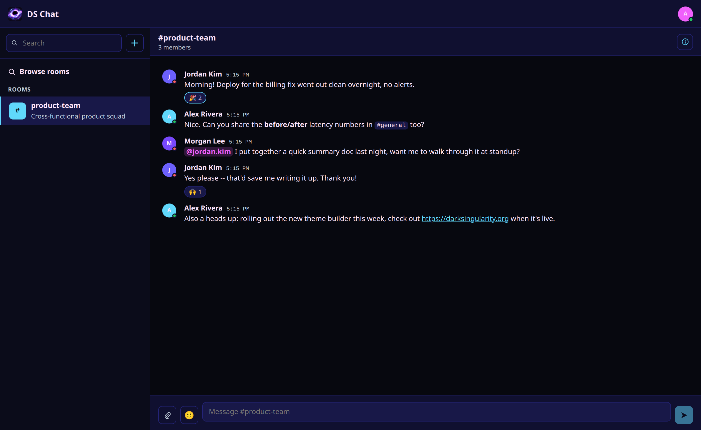
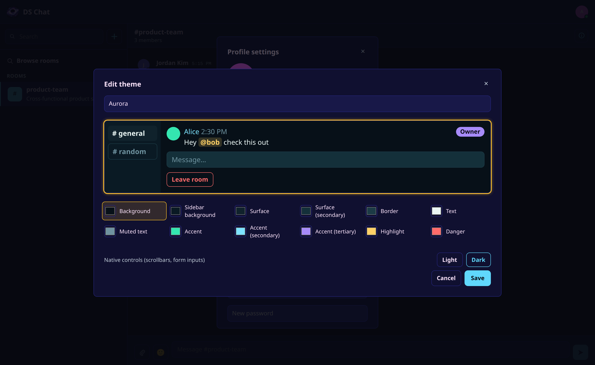
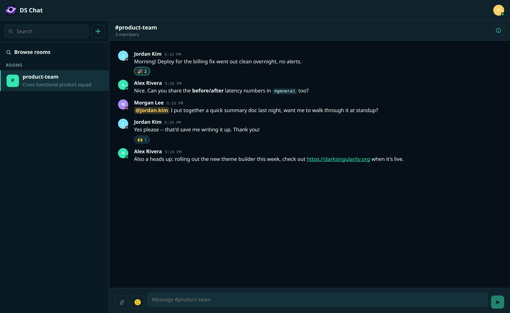

# DS Chat

A self-hosted, real-time team chat service in the spirit of Slack/Discord/
Mattermost (channel-based, no threaded conversations) — built from scratch
as a full-stack solo project, running in production on my own infrastructure
rather than as a demo. Invite-only: there's no public sign-up, every account
comes from an admin invite or a room invite. See
[ARCHITECTURE.md](ARCHITECTURE.md) for the full system design and phased
build plan.



| Custom theme builder | Same room, custom theme applied |
|---|---|
|  |  |

<sub>Also responsive on mobile — [screenshot](docs/screenshots/chat-mobile.png)</sub>

## Features

- **Auth & accounts** — session-based auth, invite-only signup (admin-issued
  site invites or room invites, both delivered by email), password reset,
  per-user light/dark/midnight/sunset presets plus a live theme builder for
  fully custom, named, savable color themes.
- **Rooms** — open and private rooms, owner/admin/member roles, invites,
  room browsing/search, file/image galleries per room.
- **Real-time chat** — WebSocket-based messaging with automatic reconnect
  and backoff, Markdown rendering, @mentions with autocomplete and inline
  highlighting, emoji reactions, message editing, image and file
  attachments (drag-and-drop, paste, or picker) with inline previews for
  images/PDFs/text/Markdown, unread indicators, and presence (online/away/
  offline, with a manual "appear offline" override).
- **Notifications** — Web Push for offline/backgrounded members, with
  per-type opt-in/out (mentions vs. all messages), plus in-app unread
  badges.
- **PWA** — installable, offline-capable (cached room/message data, a
  dedicated offline banner), with automatic update detection that prompts
  a reload as soon as a new deploy goes live.
- **Admin portal** — user management, site invites, SMTP configuration,
  audit log, and management of the bot/webhook system below.
- **Bots & integrations** — scoped API tokens for bot accounts, incoming
  webhooks (post into a room from an external system) and outgoing webhooks
  (signed HMAC event delivery on message create/update), all with SSRF
  protection on any admin-supplied external URL.
- **Scale-out** — Redis-backed pub/sub for WebSocket fan-out and presence,
  so the app runs across multiple horizontally-scaled instances rather than
  a single process.

## Tech stack

- **Backend**: Python, FastAPI, SQLAlchemy 2.0 (fully async), PostgreSQL,
  Redis, Alembic migrations, argon2 password hashing, Web Push (VAPID).
- **Frontend**: React 19, TypeScript, Vite, a hand-rolled WebSocket client
  with reconnect/backoff and visibility-aware presence, a PWA service
  worker (Workbox) for offline caching and push.
- **Deployment**: two bare Debian 13 servers (app + DB/cache), no
  containers — see [DEPLOYMENT.md](DEPLOYMENT.md).

## Structure

- [`backend/`](backend/) — FastAPI + SQLAlchemy 2.0 (async) + PostgreSQL +
  Redis. See [`backend/README.md`](backend/README.md) for local setup,
  migrations, how to create a user (site registration is invite-only — no
  public sign-up endpoint), and the full API surface.
- [`frontend/`](frontend/) — React + Vite PWA covering the full feature set:
  auth, room roles/invites, chat, offline caching, push notifications, and
  the admin portal. See [`frontend/README.md`](frontend/README.md).

## Quickstart

```bash
# 1. Postgres (see backend/README.md for details)
docker run -d --name ds-chat-postgres \
  -e POSTGRES_USER=ds_chat -e POSTGRES_PASSWORD=ds_chat -e POSTGRES_DB=ds_chat \
  -p 5432:5432 postgres:16-alpine

# 2. Redis (required — used for cross-instance WebSocket fan-out and presence)
docker run -d --name ds-chat-redis -p 6379:6379 redis:7-alpine

# 3. Backend
cd backend
python3 -m venv .venv
.venv/bin/pip install -e ".[dev]"
cp .env.example .env   # then set SESSION_SECRET
.venv/bin/alembic upgrade head
.venv/bin/python -m app.cli create-user alice alice@example.com "some-password"
.venv/bin/uvicorn app.main:app --reload &

# 4. Frontend (in another shell)
cd frontend
npm install
npm run dev
```

Then open http://localhost:5173 and log in with the account created above.
The Vite dev server proxies `/api` and `/ws` to the backend on `:8000`, so no
CORS configuration is needed in development.

## Deployment

See [DEPLOYMENT.md](DEPLOYMENT.md) for the full production runbook — two
Debian 13 servers, no containers, matching
[ARCHITECTURE.md §9](ARCHITECTURE.md#9-deployment-architecture--two-linux-servers-no-docker).

## License

AGPL-3.0-or-later — see [LICENSE](LICENSE). If you run a modified version
of this software as a network service, you must make the corresponding
source available to its users (AGPL §13).
